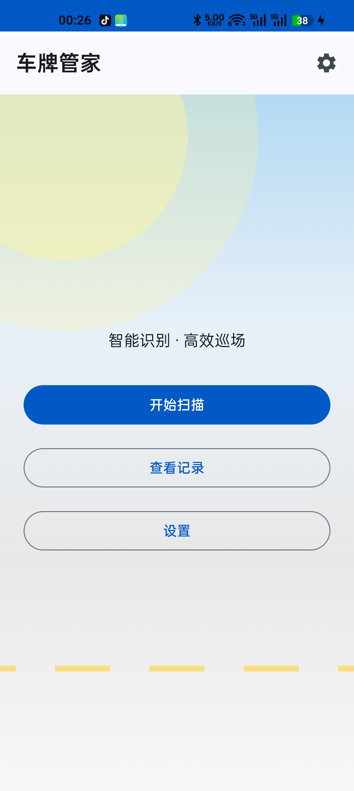
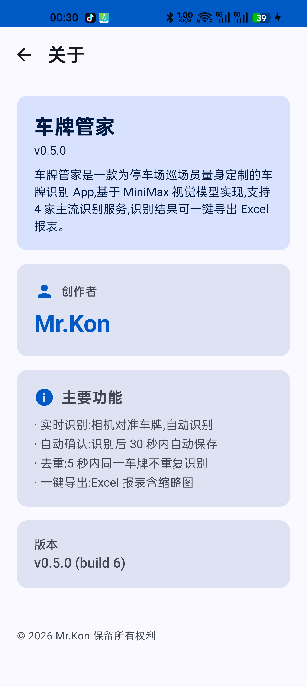
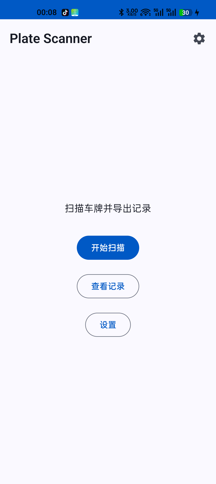

# 车牌管家 (Plate Scanner)

> 一款为停车场巡场员量身定制的 Android 车牌识别 App。
> 相机对准车牌 → 3 秒内识别 → 一键导出 Excel 报表。

由 **Mr.Kon** 开发,使用 [MiniMax](https://www.minimaxi.com) 视觉模型驱动。

[](LICENSE)
[](https://developer.android.com)
[](https://kotlinlang.org)

---

## 核心功能

- **实时识别** — 相机对准车牌,自动识别
- **自动确认** — 识别后 30 秒内自动保存
- **去重防抖** — 5 秒内同一车牌不重复识别
- **一键导出** — 识别结果导出为 Excel 报表(带缩略图)
- **多服务商** — 支持 MiniMax、OpenAI、通义千问 3 家识别服务
- **中文 UI** — 停车场主题渐变背景、设置页、关于页

## 截图

| 主页(停车场渐变背景) | 关于页(Mr.Kon) |
|:---:|:---:|
|  |  |

| 设置页(多服务商) | 记录页(Excel 导出) |
|:---:|:---:|
|  |  |

## 技术栈

| 组件 | 选型 | 说明 |
|---|---|---|
| 平台 | Android 8.0+ (minSdk 26) | CameraX 要求 API 21+;POI 5.x 要求 API 26+ |
| 语言 | Kotlin 1.9.22 | |
| UI | Jetpack Compose (BOM 2024.02) | Material 3 + 全部中文 |
| 相机 | CameraX 1.3.3 | 后置摄像头,1.7s 抓帧,JPEG 60% 质量 |
| 持久化 | Room 2.6.1 + DataStore Preferences | 识别记录 + 运行时设置 |
| 网络 | Retrofit 2.9 + OkHttp 4.12 | OpenAI-compatible Chat Completions |
| 导出 | Apache POI 5.2.3 | 生成 .xlsx(含图片) |
| DI | Hilt 2.50 | |
| 测试 | JUnit + Roborazzi + Robolectric | |

## 快速开始

### 1. 克隆仓库

```bash
git clone https://github.com/<your-username>/PlateScanner.git
cd PlateScanner
```

### 2. 配置 API Key

**方式 A — 运行时配置(推荐)**:打开 App → 设置 → 填入 API Key + 选择服务商 → 保存。

**方式 B — 编译时配置**(可选):在 `~/.gradle/gradle.properties` 添加:

```properties
MINIMAX_API_KEY=sk-cp-your-real-key-here
MINIMAX_API_BASE=https://api.minimaxi.com
```

> ⚠️ **重要**:本仓库的 `gradle.properties` 中 key 字段已注释为空字符串。**永远不要把你的真 key 提交到仓库**。

### 3. 编译 + 安装

```bash
./gradlew :app:assembleDebug
adb install app/build/outputs/apk/debug/app-debug.apk
```

### 4. 运行

打开 App → 授予相机权限 → 点"开始扫描" → 对准车牌 3 秒。

## 架构

```
app/src/main/java/com/platescanner/app/
├── camera/                CameraX 集成 + JPEG 编码 + 帧节流
├── data/                  Room 实体、DataStore、Repository
├── domain/                PlateValidator(13 个单元测试)
├── export/                POI Excel 导出
├── network/               MiniMaxApi + OpenAI-compatible provider
├── ui/
│   ├── PlateScannerApp.kt  NavHost 路由
│   ├── screen/             Home / Scanner / Records / Settings / About
│   ├── scanner/            ScannerViewModel(30s 自动确认 + 5s 去重)
│   └── theme/              Material 3 主题
└── MainActivity.kt         @AndroidEntryPoint
```

## 测试

```bash
./gradlew :app:testDebugUnitTest          # 13 个 PlateValidator + JsonExtraction 测试
./gradlew :app:recordRoborazziDebug       # JVM 上渲染 @Preview 到 PNG
```

## License

MIT © 2026 Mr.Kon — 详见 [LICENSE](LICENSE)
