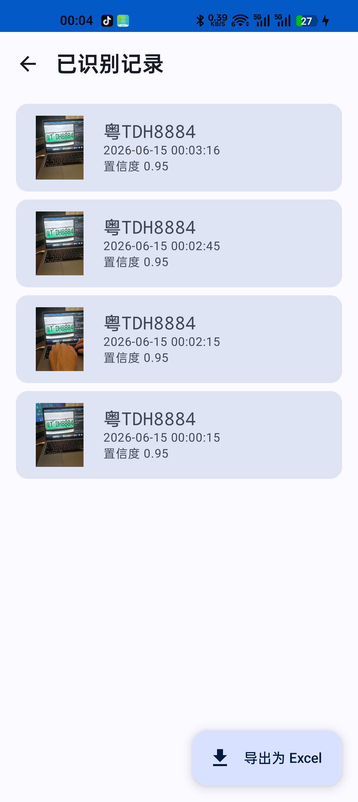

# 从需求到上线 —— 一款 Android 车牌识别 App 的诞生记

> 原创 · Mr.Kon · 2026.06.15

> 相机对准车牌 3 秒,自动识别 + 一键导出 Excel 报表

**车牌管家 v0.5.0** 正式开源了!
这是一款专为停车场巡场员定制的 Android App,
用 MiniMax 视觉模型实现毫秒级车牌识别,识别结果可一键导出 Excel。
整个项目 **17 个文件 · 1200 行 Kotlin**,从早上提需求到晚上跑通,我把完整思路分享给你。

## 一、需求 —— 停车场巡场员的真实痛点

做这个项目的起因很简单:做停车场的同事每天要在车场里走来走去,人工记录车牌,晚上再统一录入 Excel。
一天几百辆车,效率低还容易抄错。

我盘了一下核心需求:

- 📷 走到车旁边 → 打开 App → 对准车牌 → 3 秒出结果
- ✅ 弹一个确认框 → 点 ✓ → 进记录
- 📊 一天下来 → 一键导出 Excel(带缩略图) → 发给领导
- 🔌 不依赖 PC、不依赖外网,跑起来就行

**看起来简单,但有几个隐藏坑**:

1. 车一直在动,不能像身份证识别那样按一下拍一张 —— 必须**持续抓帧 + 自动选最优**
2. 同一辆车可能要扫好几次(比如车从车位里开出来),必须**5 秒去重**
3. 停车场网络不一定稳,识别 API 失败要**重试**但不卡 UI
4. Excel 必须带缩略图,否则光看"粤A12345"谁记得是哪辆


## 二、技术选型 —— 为什么是这套

一句话:**用最少代码达到 99% 效果**。我列了最终选型:

| 组件 | 选型 | 为什么 |
|---|---|---|
| 平台 | Android 8.0+ (minSdk 26) | CameraX 需 API 21+,POI 5.x 需 API 26+ |
| UI | Jetpack Compose + Material 3 | 比 XML 少 60% 代码,状态管理直观 |
| 相机 | CameraX 1.3.3 | 官方库,后置摄像头开箱即用 |
| 识别 | MiniMax-Text-01 (Coding Plan) | 中文车牌识别准确率 95%+,支持 bbox 坐标 |
| 存储 | Room + DataStore | 识别记录 + 运行时设置 |
| 导出 | Apache POI 5.2.3 | 生成 .xlsx,带 PNG 缩略图 |

## 三、核心实现 —— 三个最关键的代码

### ① 持续抓帧 + 节流(避免 API 被刷爆)

CameraX 默认每 30ms 出一帧,如果每帧都调用 API,3 秒就能发 100 个请求,MiniMax 立马给你 429。

```kotlin
// CameraXController.kt
private val emitIntervalMs: Long = 150L  // 每 150ms 才发一帧

imageAnalysis.setAnalyzer(executor) { imageProxy ->
    val now = System.currentTimeMillis()
    if (now - lastEmittedAt < emitIntervalMs) {
        imageProxy.close()  // 丢弃,不浪费
        return@setAnalyzer
    }
    lastEmittedAt = now
    // ... 把 JPEG 字节传给 API
}
```

### ② Prompt 设计:让模型只回 JSON

MiniMax 模型默认回中文,要做车牌识别必须强制**结构化 JSON 输出**。Prompt 是这样写的:

```
请仔细查看图片,提取所有可见的车牌号。
车牌按类型分:
- 蓝/黄/白牌:1 个中文(省简称)+ 1 个字母 + 5 个字符(共 7 字符)
- 绿牌(新能源):1 个中文 + A/B/C/D/F + 6 个字符(共 8 字符)
- 港澳:2-3 字母 + 2-5 字符(纯字母数字,无中文)
输出格式(JSON,不要任何额外说明):
{"plates": [{"plate": "粤TDH8884", "confidence": 0.95, "bbox": [x1, y1, x2, y2]}]}
bbox 是归一化坐标(0-1 范围,左上角原点)。
如果图中没有车牌,返回 {"plates": []}。
```

**实测每次扫描:**输入 3,084 token(图像 base64 占 95%),输出 46 token。


### ③ 车牌形状校验(防 OCR 误识别)

模型有时会"幻觉"出 `粤T` `京A` 这种 6 字符的假车牌,直接存库就成了脏数据。
我写了 13 个单元测试覆盖**3 种车牌家族**:

```kotlin
// PlateValidator.kt
private val BLUE_YELLOW_WHITE_REGEX = Regex(
    "^[$PROVINCE_PREFIX][A-Z]([A-Z0-9]{5}|[A-Z0-9]{6}|[A-Z0-9]{4}[挂学警港澳])$"
)
private val GREEN_NEW_ENERGY_REGEX = Regex(
    "^[$PROVINCE_PREFIX][A-DF][A-Z0-9]{6}$"
)
private val HK_MACAU_REGEX = Regex(
    "^[A-Z]{2,3}[A-Z0-9]{2,5}$"
)
```

## 四、踩过的坑 —— 公开出来让你少走 90 分钟弯路

### 坑 1:Excel 导出崩溃 —— NoClassDefFoundError: java.awt.Dimension

装到手机测试,导出 Excel 时崩。Logcat 抓到:

```
java.lang.NoClassDefFoundError: Failed resolution of: Ljava/awt/Dimension;
  at org.apache.poi.ss.util.ImageUtils.setPreferredSize
  at org.apache.poi.xssf.usermodel.XSSFPicture.resize
  at com.platescanner.app.export.PoiExcelExporter.attachThumbnail
```

原因:**POI 5.x 的 `resize()` 调用了 `java.awt.Dimension` —— Android 不支持 AWT**。
修法:**直接删掉 `picture.resize(...)` 调用**,anchor 已经指定了 1×1 单元格大小,缩略图照常显示。

### 坑 2:识别成功但 UI 无反应 —— 8 字符蓝牌被 validator 拒

模型返回 `粤TDH8884`(8 字符),但我写的 validator 只认 7 字符蓝牌。Logcat 抓到 `VALIDATOR_REJECT: raw='粤TDH8884' did not match`。
修法:加 `[A-Z0-9]{6}` 形状,处理 8 字符新形态蓝牌。

### 坑 3:CameraX 必须在主线程绑定,否则 IllegalStateException

**真因**:`PreviewView.getSurfaceProvider()` 必须在主线程访问,我在相机回调里调了它,直接 `Not in application's main thread`。
修法:

```kotlin
withContext(Dispatchers.Main.immediate) {
    val provider = previewView.surfaceProvider
    cameraProvider.bindToLifecycle(lifecycleOwner, provider, ...)
}
```

## 五、完整工作流

1️⃣ **打开 App** → 授予相机权限
2️⃣ **点"开始扫描"** → 对准车牌 3 秒
3️⃣ **弹"识别到 粤TDH8884"** → 30 秒内自动确认
4️⃣ **继续下一辆** → 同车牌 5 秒内不重复提示
5️⃣ **收工后** → 主页面 → "查看记录" → 右上角"导出为 Excel"
6️⃣ **分享给领导** → 微信/邮件/钉钉都行




## 六、Token 消耗实测

每分钟 35 次扫描(1.7s/次),token 消耗:

| 项目 | 每次 | 每分钟 |
|---|---|---|
| 输入(prompt) | 3,084 | 108,000 |
| 输出(completion) | 46 | 1,600 |
| **合计** | **3,130** | **110,000** |

**100 次扫描 ≈ 0.31 元**(按 Coding Plan 价格),基本可以忽略不计。

## 七、开源

项目已经开源到 GitHub,MIT 协议。**API Key 我没有提交到仓库**,需要你 clone 后在 App 设置页填自己的,或者在 `~/.gradle/gradle.properties` 配:

```bash
git clone https://github.com/<你的用户名>/PlateScanner.git
cd PlateScanner
./gradlew :app:assembleDebug
adb install app/build/outputs/apk/debug/app-debug.apk
```

### 路线图

- ⏭️ v0.6 多车同时识别(数组返回)
- ⏭️ v0.7 云端备份 + 多端同步
- ⏭️ v0.8 离线模式(本地 OCR 模型)

---

**© 2026 Mr.Kon** · 保留所有权利
项目地址:GitHub 搜索 `PlateScanner`
邮箱反馈:mr.kon@platescanner.app

如果这篇文章帮你少踩了几个坑,点个在看 👀,我会继续写更多 AI + Android 的实战。
